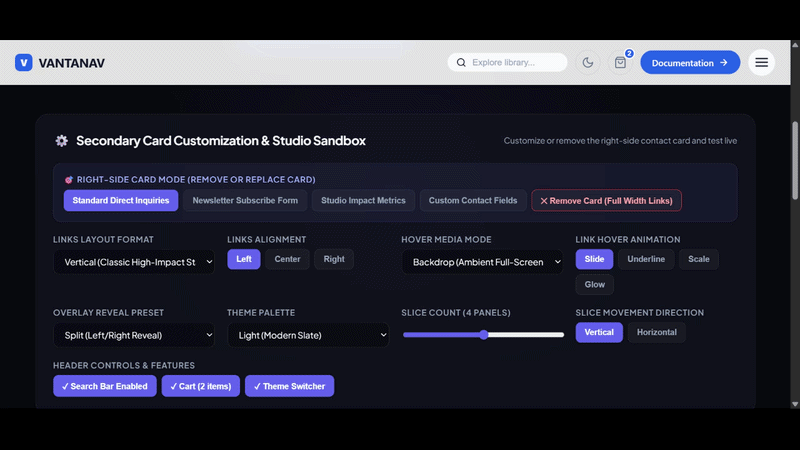

# VantaNav UI 🌌

> **Production-Ready Animated Overlay Navigation System for React**
> Transform traditional website navigation into an immersive, cinema-grade overlay experience with staggered multi-slice reveals, fluid micro-interactions, responsive mega-menus, and built-in accessibility.

[](https://www.npmjs.com/package/vanta-nav)
[](https://opensource.org/licenses/MIT)
[](https://www.typescriptlang.org)
[](https://motion.dev)

---

<p align="center">
  
</p>

---

## ✨ Highlights

- 🎭 **Signature Slice Reveal Engine**: Multi-panel staggered curtains (2 to 6 panels) with smooth cubic-bezier easing.
- 🚀 **6 Built-in Animation Presets**: `slice`, `curtain`, `split`, `slide`, `fade`, and `scale`.
- 🎛️ **Dual API Paradigms**: Instant configuration via `<OverlayNavbar items={...} />` or advanced compound composition (`<NavbarBrand>`, `<NavbarOverlay>`, `<NavbarLinks>`).
- 🎨 **Deep Theming via CSS Tokens**: 6 curated presets (`dark`, `light`, `cyber`, `emerald`, `sunset`, `minimal`) plus effortless CSS variable overrides.
- ⚡ **Lightweight & High-Performance**: Tree-shakeable ESM/CJS build under 65 kB gzipped. No heavy third-party dependencies.
- ♿ **Strict Accessibility (A11y)**: Focus trapping in modal states, Escape key handling, background scroll-locking with layout shift compensation, and automated `prefers-reduced-motion` detection.
- 📱 **Responsive & Mobile-Ready**: Fluid typography, touch-friendly expandable submenus, and adaptive breakpoints.

---

## 📦 Installation

```bash
# npm
npm install vanta-nav motion

# pnpm
pnpm add vanta-nav motion

# yarn
yarn add vanta-nav motion
```

> **Note:** `motion` (Motion for React v11 or v12) is declared as a peer dependency.

---

## 🚀 Quick Start

Import the component and its stylesheet into your application:

```tsx
import { OverlayNavbar } from "vanta-nav";
import type { NavItem } from "vanta-nav";
import "vanta-nav/styles.css";

const links: NavItem[] = [
  { label: "Home", href: "/" },
  {
    label: "Products",
    children: [
      { label: "Design Systems", href: "/products/design-systems", description: "UI Component Kits" },
      { label: "Templates", href: "/products/templates", description: "Production Ready Apps" },
    ],
  },
  { label: "Studio", href: "/studio" },
  { label: "Journal", href: "/journal", badge: "New" },
  { label: "Contact", href: "/contact" },
];

export default function App() {
  return (
    <OverlayNavbar
      logo="STUDIO ZERO"
      items={links}
      animation="slice"
      sliceCount={4}
      theme="dark"
      position="fixed"
      showSearch
      showCart
      cartCount={3}
      showThemeToggle
      cta={{
        label: "Book a Demo",
        href: "/contact",
        variant: "primary",
      }}
      closeOnNavigate
    />
  );
}
```

---

## 🎬 Animation Presets

VantaNav provides a preset-driven animation system that eliminates boilerplate animation code:

| Preset                  | Description                                                                       |
| ----------------------- | --------------------------------------------------------------------------------- |
| `slice` *(Default)* | Multi-panel vertical or horizontal staggered slice reveal with coordinated entry. |
| `curtain`             | Dual panels meeting from top and bottom.                                          |
| `split`               | Screen splits into left and right wings revealing the navigation canvas.          |
| `slide`               | Clean directional slide from`top`, `bottom`, `left`, or `right`.          |
| `fade`                | Minimal glassmorphic opacity fade and backdrop blur.                              |
| `scale`               | Center-out radial clip-path and subtle scale expansion.                           |

### Configuring Slice Count & Direction

```tsx
<OverlayNavbar
  animation="slice"
  sliceCount={5}              // 2 to 6 panels
  sliceDirection="horizontal" // 'vertical' | 'horizontal'
  duration={0.65}             // seconds
  stagger={0.08}              // seconds delay between slices
/>
```

---

## 🖼️ Image & Video Hover Previews

Attach photography or autoplaying video reels directly to any navigation item. When the user hovers over a link, VantaNav transitions the media in real time:

```tsx
const links: NavItem[] = [
  {
    label: "Case Studies",
    href: "/work",
    image: "/previews/case-studies.webp",
    description: "High-impact digital products & design systems",
  },
  {
    label: "Showreel",
    href: "/reel",
    video: "/videos/reel-2026.mp4",
    description: "Watch our kinetic agency studio reel",
  },
];

<OverlayNavbar
  items={links}
  mediaPreviewMode="panel" // 'panel' | 'floating' | 'backdrop' | 'none'
/>
```

### Preview Modes

- **`panel`** *(Default)*: Displays the media in an interactive card in the secondary column with title badge and description.
- **`floating`**: Renders a magnetic floating preview card that tracks the user's mouse position with spring physics.
- **`backdrop`**: Smoothly crossfades an ambient background video or image behind the entire navigation menu.
- **`none`**: Standard text-only display.

---

## 📐 Modern Layouts & Alignments

Customize the visual direction, composition, and text alignment of your navigation menu:

```tsx
<OverlayNavbar
  items={links}
  linksLayout="grid"       // 'vertical' | 'grid' | 'staggered-zigzag' | 'split-columns' | 'horizontal'
  linksAlign="center"      // 'left' | 'center' | 'right'
  hoverEffect="underline"  // 'slide' | 'underline' | 'scale' | 'glow'
/>
```

| Layout                     | Description                                                                         |
| -------------------------- | ----------------------------------------------------------------------------------- |
| `vertical` *(Default)* | Classic high-impact vertical typographic stack.                                     |
| `grid`                   | Modern 2-column agency responsive grid layout.                                      |
| `staggered-zigzag`       | Editorial high-fashion asymmetric staggered diagonal flow with alternating offsets. |
| `split-columns`          | Multi-column categorical columns.                                                   |
| `horizontal`             | Inline strip flow with responsive wrapping.                                         |

---

## 🎛️ Secondary Card Customization & Removal

The right-side "Direct Inquiries" card in the overlay can be completely removed, styled with custom contact data, or replaced with any custom React node (e.g., newsletter signup, live metrics, mini player, booking widget):

### 1. Remove Card Completely (Full-Width Navigation)
To hide the card and allow the menu links to expand across the full width of the overlay:
```tsx
<OverlayNavbar
  items={links}
  showSecondaryPanel={false} // Hides the card and expands navigation full-width
/>
```

### 2. Custom Contact Information
To customize the title, email, phone, support hours, or address without writing any JSX:
```tsx
<OverlayNavbar
  items={links}
  contactInfo={{
    title: "Client Partnerships",
    description: "Ready to launch your next breakthrough digital experience?",
    email: "partners@yourstudio.com",
    phone: "+1 (555) 987-6543",
    hours: "Available 24/7 for Enterprise Clients",
    address: "SoHo, New York, NY",
  }}
/>
```

### 3. Replace with Any Custom React Component
You can pass any React node to `secondaryContent` to replace the card entirely:
```tsx
<OverlayNavbar
  items={links}
  secondaryContent={
    <div className="newsletter-card">
      <h3>Stay in the Loop</h3>
      <p>Receive our weekly architecture and design dispatches.</p>
      <form onSubmit={(e) => { e.preventDefault(); alert("Subscribed!"); }}>
        <input type="email" placeholder="Enter your email" />
        <button type="submit">Join Newsletter</button>
      </form>
    </div>
  }
/>
```

---

## 🎨 Theming & Customization

VantaNav is built with CSS Custom Properties. You can switch themes via the `theme` prop or override CSS variables directly in your global stylesheet:

```tsx
<OverlayNavbar theme="cyber" />
```

Available presets: `dark` (default), `light`, `cyber`, `emerald`, `sunset`, `minimal`.

### CSS Variables Reference

```css
:root {
  /* Surface & Typography */
  --vantanav-bg: #0b0c10;
  --vantanav-surface: #14161f;
  --vantanav-surface-hover: #1f2330;
  --vantanav-fg: #f3f4f6;
  --vantanav-fg-muted: #9ca3af;
  --vantanav-accent: #6366f1;
  --vantanav-accent-hover: #4f46e5;
  --vantanav-border: rgba(255, 255, 255, 0.08);

  /* Slice Panel Backgrounds */
  --vantanav-slice-bg-1: #090a0f;
  --vantanav-slice-bg-2: #0e1017;
  --vantanav-slice-bg-3: #131620;
  --vantanav-slice-bg-4: #191d2a;
  --vantanav-slice-bg-5: #1e2333;

  /* Dimensions & Glassmorphism */
  --vantanav-header-height: 72px;
  --vantanav-glass-blur: 16px;
  --vantanav-overlay-backdrop: rgba(0, 0, 0, 0.75);
}
```

---

## 🧱 Advanced Composition (Compound Components)

If you require fine-grained control over the header layout or overlay content, use the composable primitives:

```tsx
import {
  OverlayNavbar,
  NavbarBrand,
  NavbarTrigger,
  NavbarOverlay,
  NavbarLinks,
  NavbarActions,
  NavbarSearch,
  NavbarThemeToggle,
} from "vanta-nav";
import "vanta-nav/styles.css";

export function CustomHeader() {
  return (
    <OverlayNavbar animation="slice">
      <NavbarBrand href="/">ATELIER</NavbarBrand>

      <NavbarActions>
        <NavbarSearch onSearch={(q) => console.log(q)} />
        <NavbarThemeToggle />
        <NavbarTrigger />
      </NavbarActions>

      <NavbarOverlay
        secondaryContent={
          <div>
            <h3>Studio HQ</h3>
            <p>Tokyo · London · New York</p>
          </div>
        }
      >
        <NavbarLinks items={myCustomLinks} />
      </NavbarOverlay>
    </OverlayNavbar>
  );
}
```

---

## 🌐 Next.js & Client Boundary

Because VantaNav utilizes browser window events (Escape key, scroll-locking, focus management) and Motion for React animations, specify the `"use client"` directive when wrapping in Next.js App Router:

```tsx
// components/SiteNav.tsx
"use client";

import { OverlayNavbar } from "vanta-nav";
import "vanta-nav/styles.css";

export function SiteNav() {
  return <OverlayNavbar logo="MY APP" items={...} />;
}
```

---

## 🧭 Router Integration (Next.js / React Router)

VantaNav uses standard semantic HTML anchor tags (`<a>`) and buttons. You can pass custom click handlers or intercept navigation:

```tsx
import { useNavigate } from "react-router-dom"; // or useRouter in Next.js

const links: NavItem[] = [
  {
    label: "Dashboard",
    onClick: (e) => {
      e.preventDefault();
      navigate("/dashboard");
    },
  },
];
```

---

## 📖 API Reference

### `OverlayNavbar` Props

| Prop                    | Type                                    | Default        | Description                            |
| ----------------------- | --------------------------------------- | -------------- | -------------------------------------- |
| `logo`                | `ReactNode`                           | `"VANTANAV"` | Brand logo or custom component         |
| `items`               | `NavItem[]`                           | `[]`         | Array of navigation link items         |
| `animation`           | `AnimationPreset`                     | `"slice"`    | Overlay reveal preset                  |
| `sliceCount`          | `number`                              | `4`          | Number of slices for slice animation   |
| `sliceDirection`      | `"vertical" \| "horizontal"`           | `"vertical"` | Direction of slice movement            |
| `slideDirection`      | `"top" \| "bottom" \| "left" \| "right"` | `"top"`      | Direction for slide preset             |
| `duration`            | `number`                              | `0.65`       | Animation duration in seconds          |
| `stagger`             | `number`                              | `0.08`       | Stagger delay between slices and items |
| `position`            | `"fixed" \| "sticky" \| "relative"`     | `"fixed"`    | Navbar layout positioning              |
| `theme`               | `ThemeName`                           | `"dark"`     | Active theme palette preset            |
| `closeOnNavigate`     | `boolean`                             | `true`       | Close overlay when a link is clicked   |
| `closeOnEscape`       | `boolean`                             | `true`       | Dismiss overlay on Escape key          |
| `closeOnOutsideClick` | `boolean`                             | `true`       | Dismiss overlay when clicking backdrop |
| `lockScroll`          | `boolean`                             | `true`       | Prevent background scrolling when open |
| `showSearch`          | `boolean`                             | `false`      | Display search trigger input in header |
| `showCart`            | `boolean`                             | `false`      | Display shopping cart icon and badge   |
| `cartCount`           | `number`                              | `0`          | Number of items in shopping cart badge |
| `showThemeToggle`     | `boolean`                             | `false`      | Display light/dark theme switch icon   |
| `cta`                 | `NavbarCTAProps`                      | `undefined`  | Call-to-action button configuration    |
| `secondaryContent`    | `ReactNode`                           | `undefined`  | Custom panel rendered alongside links  |
| `onOpen`              | `() => void`                          | `undefined`  | Callback fired when overlay opens      |
| `onClose`             | `() => void`                          | `undefined`  | Callback fired when overlay closes     |
| `onNavigate`          | `(item: NavItem) => void`             | `undefined`  | Callback fired on link click           |

---

## 🧪 Development & Scripts

```bash
# Start local interactive demo playground
npm run dev

# Build production bundle (ESM, CJS, DTS, CSS)
npm run build

# Run unit test suite
npm run test

# Run test coverage
npm run test:coverage

# Run TypeScript typecheck
npm run typecheck

# Run linter
npm run lint

# Validate npm pack dry-run
npm run pack:check
```

---

## 📄 License

MIT © Ritik
